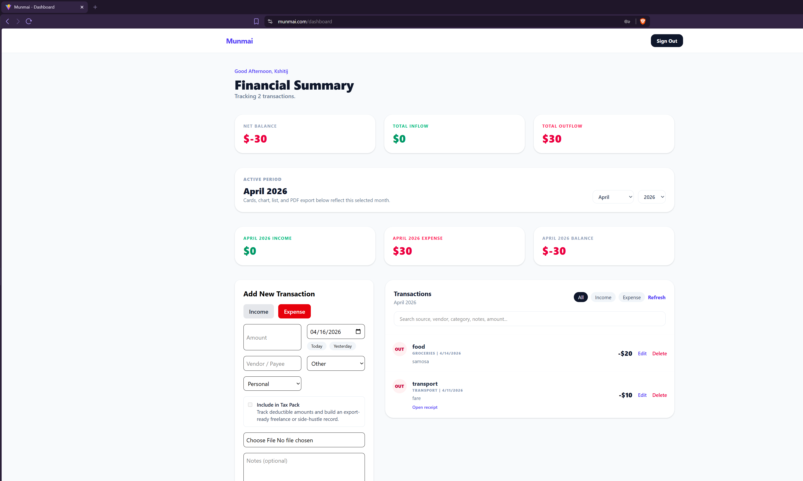
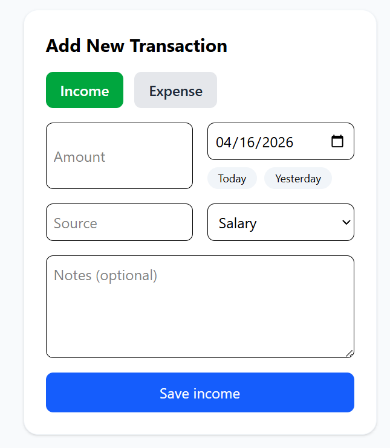
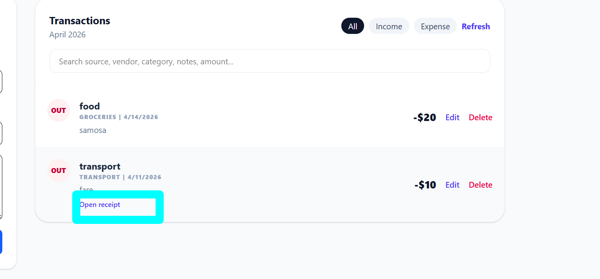
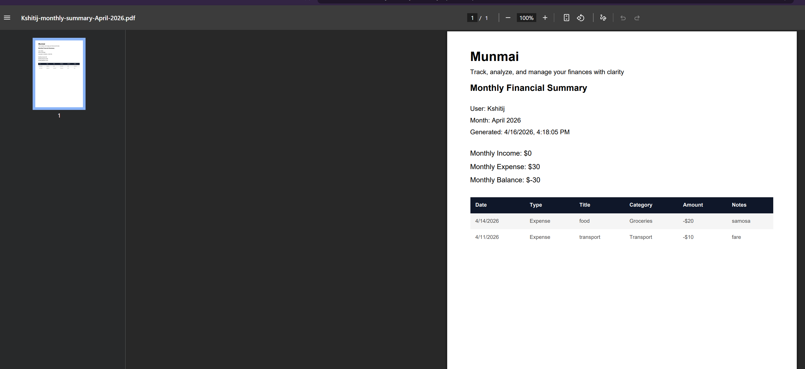

# Munmai

Munmai is a production-ready personal finance and expense tracking application that helps users manage income, expenses, receipts, and tax-ready financial records through a clean and reliable interface.

---

## 🌐 Live Demo

- Frontend: https://munmai.com  
- Backend API: https://munmai-api.onrender.com  

---

## 🚀 Features

### 🔐 Authentication & Security
- User registration with email verification
- Secure login using JWT authentication
- Protected routes with user-specific data isolation

### 💰 Finance Tracking
- Add, edit, and delete income and expense transactions
- Categorize transactions for better insights
- Monthly financial summary (income, expense, balance)

### 🧾 Receipt Management
- Upload receipts with transactions
- Secure backend-controlled receipt access (not publicly exposed)
- Replace and delete receipts safely

### 📊 Dashboard & Analytics
- Monthly summary cards
- Category-based expense breakdown
- Transaction filtering and search

### 📦 Export & Reporting
- Monthly PDF financial report
- Tax pack CSV export for deductible expenses
- Structured reports for real-world usage

### ⚙️ Production Quality
- Error boundaries for UI crash protection
- User feedback states (success, error, loading)
- Telemetry logging for debugging
- Stable and clean UX flows

---

## 🛠 Tech Stack

### Frontend
- React (Vite)
- Tailwind CSS
- Axios
- Recharts

### Backend
- Node.js
- Express.js
- MongoDB (Mongoose)
- JWT Authentication
- Nodemailer (Email verification)
- Multer (File uploads)

### Infrastructure
- Vercel (Frontend Hosting)
- Render (Backend Hosting)
- Cloudflare (Domain & DNS)
- MongoDB Atlas (Database)

---

## 🧠 Architecture Overview

User → munmai.com (Vercel) → API (Render) → MongoDB Atlas

### Key Decisions
- Environment-based configuration for production safety
- Secure receipt access via backend routes (no public file exposure)
- CORS configured for custom domain
- Email verification required before account activation

---

## 🔑 Environment Variables

### Backend (.env)

PORT=5000  
MONGO_URI=your_mongodb_uri  
JWT_SECRET=your_secret  

SMTP_HOST=your_smtp_host  
SMTP_PORT=your_smtp_port  
SMTP_USER=your_email  
SMTP_PASS=your_password  
SMTP_FROM=no-reply@munmai.com  

CLIENT_URL=https://munmai.com  
CLIENT_ORIGINS=https://munmai.com,https://www.munmai.com  
SERVER_URL=https://munmai-api.onrender.com  

---

### Frontend (.env)

VITE_API_URL=https://munmai-api.onrender.com/api  

---

## 💻 Local Setup

### 1. Clone the repository

https://github.com/kshitijchaudhary/munmai
cd munmai

---

### 2. Setup backend

cd server  
npm install  
npm run dev  

---

### 3. Setup frontend

cd client  
npm install  
npm run dev  

---

## 📸 Screenshots

## 📸 Screenshots

### Dashboard

### Add Transaction

### Transactions

### Receipt View

### PDF Report

---

## 📈 Roadmap

Planned improvements:

- Multiple currency support (including NPR)
- Advanced analytics (income vs expense charts)
- Liabilities and starting balance tracking
- Shared expenses and split payments
- Multi-language support

---

## ⚡ Key Learnings

- Handling real-world CORS issues in production
- SMTP email verification setup and debugging
- Secure file handling vs public uploads
- Full-stack deployment across Vercel, Render, and Cloudflare
- Domain configuration and DNS debugging
- Building resilient UX with proper feedback states

---

## 👨‍💻 Author

Kshitij Chaudhary  
Full Stack Developer  

---

## 📄 License

This project is for educational and portfolio purposes.