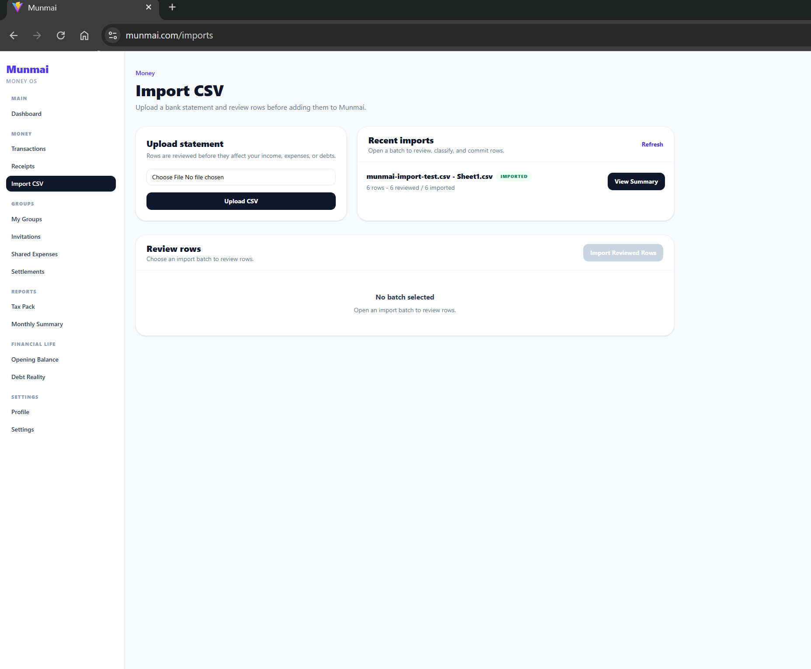

# Munmai

A full-stack financial clarity system for tracking income, expenses, shared money, debt pressure, and reviewed CSV imports.

Munmai is a production-deployed MERN application built to help people understand where their money is going, what they owe, what others owe them, and how imported financial data should be reviewed before it changes their records.

## Live Links

- Live app: [https://munmai.com](https://munmai.com)
- Backend: [https://munmai-api.onrender.com](https://munmai-api.onrender.com)
- API health: [https://munmai-api.onrender.com/api/health](https://munmai-api.onrender.com/api/health)
- GitHub repo: add repository link here

## Feature Overview

- Dashboard overview: all-time personal balance, monthly snapshot, spending breakdown, shared money, Monthly Control, and Debt Reality preview.
- Income and expense tracking: create, view, filter, edit, and manage personal money movement.
- Receipt tracking: review expenses with and without receipts.
- Monthly Control: set a monthly spending limit and track safe, warning, or over-budget status.
- Debt Reality: track personal debts, credit cards, loans, bills, due dates, and recorded payments.
- Import CSV Review Queue: upload CSV statements, review every row, classify it, skip rows, and commit only reviewed data.
- Shared Groups: create groups, invite users, join by code, approve join requests, add shared expenses, and view members.
- Settlements: record payments between group members and reduce outstanding balances.
- Monthly Summary: review selected-month income, expenses, net flow, category breakdown, budget pace, and debt pressure.
- Opening Balance: set starting money position without counting it as monthly income.
- Tax Pack foundation: track deductible expenses and export tax-oriented CSV data.

## Why I Built Munmai

Managing personal money is often confusing because income, expenses, debts, receipts, shared costs, and imported bank rows live in separate places. Shared expenses are especially easy to lose track of when friends or roommates manually settle up over time.

Munmai was built for students, workers, and everyday users who need a clear view of spending, debt pressure, and shared money without turning every financial task into a spreadsheet. CSV imports are intentionally review-first because bank rows should not automatically affect financial records without user confirmation.

## How Munmai Works

1. Add income and expenses manually from the Transactions page.
2. Upload a CSV bank statement into the Import Review Queue.
3. Review imported rows before they affect Munmai records.
4. Classify rows as income, expense, debt payment, transfer, or ignore.
5. Track monthly budget pace with Monthly Control.
6. Track debts and record debt payments through Debt Reality.
7. Manage shared group expenses, settlements, and balances with group members.
8. Review monthly trends in Monthly Summary and tax-oriented expense data in Tax Pack.

## Screenshots





## Tech Stack

### Frontend

- React
- Vite
- Tailwind CSS
- Axios
- Recharts

### Backend

- Node.js
- Express.js
- MongoDB
- Mongoose

### Auth

- JWT authentication
- Protected API routes
- User-owned data access patterns

### Deployment

- Frontend: Vercel
- Backend: Render
- Database: MongoDB Atlas

## Architecture

Munmai uses a client/server MERN structure:

- `client/`: React + Vite frontend with page-level routes, reusable components, and API helper modules.
- `server/`: Express API with route, controller, service, and Mongoose model layers.
- Protected routes use JWT auth middleware and attach the authenticated user to each request.
- Personal data such as income, expenses, receipts, budget settings, liabilities, imports, and opening balance is scoped to the authenticated user.
- Group data uses memberships to control access to shared expenses, settlements, balances, invitations, and join-code flows.
- Import Review Queue stores uploads as batches and rows first, then creates financial records only after review and commit.
- Debt Reality stores liabilities separately from liability payment records so balances can be reduced over time.
- Group money calculations aggregate expense splits and settlements to produce netted balances.

See [docs/ARCHITECTURE.md](docs/ARCHITECTURE.md) for a fuller system overview.

## API Module Summary

- Auth: registration, login, email verification, forgot password, reset password.
- Dashboard: personal finance summary and shared money summary.
- Income: authenticated income records.
- Expenses: authenticated expense records and receipt metadata.
- Receipts: receipt upload and receipt-related review flows.
- Groups: group creation, membership, invitations, join codes, shared expenses, summaries, and balances.
- Settlements: group settlement recording and history.
- Budget: Monthly Control budget setting and current-month spending pace.
- Liabilities / Debt Reality: debts, payment records, summaries, and debt pressure.
- Imports: CSV upload, import batches, import rows, review updates, skip row, cancel/remove, and commit.
- Reports / Monthly Summary: read-only monthly reporting built from existing income, expense, budget, and debt data.
- Opening Balance: personal starting balance used in all-time personal balance.

## Release History

- v1.2.1 Group Collaboration Polish: improved invite UX, group membership display, join code flow, and group management controls.
- v1.3.0 Monthly Control Budget MVP: added monthly spending limit tracking and budget status.
- v1.3.2 Budget Clarity Polish: added progress bar, daily safe spend, clearer labels, and better budget insight copy.
- v1.4.0 Debt Reality MVP: added personal liabilities, debt summaries, and payment recording.
- v1.5.0 Import Review Queue MVP: added CSV upload, row review, classification, skip row, and reviewed commit flow.
- v1.5.1 Sidebar Completion and Demo Polish: added Monthly Summary, Opening Balance, and Settings pages.
- v1.5.2 Portfolio Documentation Polish: refreshed project documentation for portfolio and interview review.

## Local Setup

### 1. Clone

```bash
git clone <your-repo-url>
cd fintrack
```

### 2. Install dependencies

```bash
npm install
npm install --prefix server
npm install --prefix client
```

### 3. Configure environment variables

Create `server/.env` and `client/.env` using safe local values. Do not commit real secrets.

### 4. Run backend and frontend together

```bash
npm run dev
```

### 5. Run separately if needed

```bash
npm run dev --prefix server
npm run dev --prefix client
```

## Environment Variables

### Backend: `server/.env`

```env
MONGO_URI=mongodb+srv://<user>:<password>@<cluster>/<database>
JWT_SECRET=replace_with_strong_secret
CLIENT_URL=http://localhost:5173
SERVER_URL=http://localhost:5000
CLIENT_ORIGINS=http://localhost:5173,https://munmai.com
FORCE_HTTPS=false
REQUEST_BODY_LIMIT=1mb
UPLOAD_DIR=./uploads

SMTP_HOST=smtp.example.com
SMTP_PORT=587
SMTP_USER=example@example.com
SMTP_PASS=replace_with_smtp_password
SMTP_FROM="Munmai <no-reply@example.com>"
```

### Frontend: `client/.env`

```env
VITE_API_URL=http://localhost:5000/api
```

## Deployment Notes

- Frontend is deployed on Vercel.
- Backend is deployed on Render.
- MongoDB runs on MongoDB Atlas.
- Receipt uploads currently use server-side upload storage, so production deployments need a persistence strategy for uploaded files.
- The backend exposes `/api/health` for health checks.

## Portfolio / Interview Value

Munmai demonstrates:

- Full-stack MERN development with real product workflows.
- JWT authentication and protected API design.
- CRUD systems with user-specific data ownership.
- Financial data modeling for transactions, groups, debts, imports, and settlements.
- CSV import safety through a review queue instead of blind automation.
- Incremental product releases with scoped MVPs and polish passes.
- Production deployment across Vercel, Render, and MongoDB Atlas.
- Practical UX decisions for financial clarity, not just data entry.

## Additional Docs

- [Architecture](docs/ARCHITECTURE.md)
- [Demo Flow](docs/DEMO_FLOW.md)
- [Interview Notes](docs/INTERVIEW_NOTES.md)

## Author

Kshitij Chaudhary  
Full Stack Developer, Canada

## Status

- Production deployed.
- Actively developed.
- Portfolio-ready.
