<div align="center">

# Munmai

### Your money, without the accounting friction.

A production-deployed personal and shared finance platform for transactions, receipts, bank-statement imports, debt, budgets, and group expenses.

[**Open Munmai**](https://munmai.com) · [API Health](https://munmai-api.onrender.com/api/health) · [View Repository](https://github.com/kshitijchaudhary/munmai)

**Web: Live** · **Mobile: Active development**

</div>

---

## The product

Munmai is designed around the questions people actually ask about money:

> How much do I have left? Where did my money go? Did my friend pay me back? Can I scan this receipt and move on?

Instead of behaving like a traditional accounting tool, Munmai connects daily money activity with the records behind it—transactions, receipts, imported statements, debts, budgets, shared expenses, and settlements.

## One system, two experiences

| Munmai Web | Munmai Mobile |
| --- | --- |
| Deeper review, reporting, imports, debt, tax, and group management | Fast capture, recent activity, receipts, insights, and shared spaces |
| Production deployed | Expo/React Native client in active development |
| Built for reviewing and understanding | Built for completing common actions in seconds |

The mobile experience is evolving around five human-centered destinations:

**Today · Activity · Capture · Insights · Spaces**

## What works today

| Area | Capability |
| --- | --- |
| **Daily money** | Add, edit, filter, and review income and expenses; maintain an opening balance |
| **Receipts** | Upload images/PDFs, manage metadata, search, filter, archive, and check receipt coverage |
| **Statement imports** | Review CSV rows and preview text-based PDFs before anything affects financial records |
| **Import safety** | Detect duplicate rows, inspect batch history, archive imports, and safely revert them |
| **Monthly control** | Track income, spending, net flow, categories, budget pace, and safe-spend status |
| **Debt reality** | Track liabilities, due dates, balances, payments, and debt pressure |
| **Shared money** | Create groups, invite or approve members, split expenses, record settlements, and calculate net balances |
| **Tax foundation** | Mark deductible expenses and export tax-oriented CSV data |
| **Trust** | Protected files, user-scoped records, legal pages, and clear storage information |

## The engineering behind it

Munmai goes beyond basic financial CRUD. Several workflows are designed specifically around data trust and failure recovery.

### Review before commit

Uploaded bank statements first become reviewable rows. Users can classify, edit, select, or skip those rows before confirming an import.

### Duplicate prevention

Deterministic fingerprints prevent the same statement row from being imported repeatedly across batches.

### Reversible imports

Confirmed imports retain batch and row history, allowing users to inspect and safely revert previously created records.

### Protected documents

Receipt files are not exposed as public static uploads. The API authenticates the request and verifies ownership before streaming a file.

### Mobile partial-failure recovery

An expense and its receipt are uploaded in separate steps. If the receipt fails after the expense is created, the mobile client preserves a retry state without creating a duplicate expense.

## System architecture

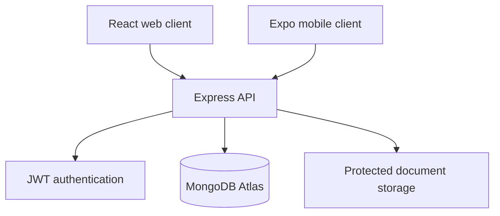

The backend uses route, controller, service, and Mongoose model layers. Authentication middleware resolves the current user, personal records are owner-scoped, and shared workflows require group membership.

```text
client/    React + Vite web application
server/    Express API and business logic
mobile/    Expo + React Native application
docs/      Architecture and project documentation
```


## Quick demo

1. Open the current money overview.
2. Add an income or expense.
3. Upload and organize a receipt.
4. Preview a CSV or PDF statement and confirm selected rows.
5. Inspect duplicate protection and reversible import history.
6. Review budget pace and debt pressure.
7. Add a shared expense and record a settlement.
8. Open Monthly Summary and the Tax Pack foundation.

Demo access is available upon request.

## Technology

| Layer | Stack |
| --- | --- |
| Web | React, Vite, Tailwind CSS, Axios, Recharts |
| Mobile | React Native, Expo, Expo Router |
| Backend | Node.js, Express.js |
| Database | MongoDB, Mongoose |
| Security | JWT authentication, protected routes, owner-scoped access |
| Deployment | Vercel, Render, MongoDB Atlas |

<details>
<summary><strong>Run the web application locally</strong></summary>

### Clone and install

```bash
git clone https://github.com/kshitijchaudhary/munmai.git
cd munmai

npm install
npm install --prefix server
npm install --prefix client
```

### Backend environment

Create `server/.env`:

```env
MONGO_URI=mongodb+srv://<user>:<password>@<cluster>/<database>
JWT_SECRET=replace_with_a_strong_secret
CLIENT_URL=http://localhost:5173
SERVER_URL=http://localhost:5000
CLIENT_ORIGINS=http://localhost:5173,https://munmai.com
FORCE_HTTPS=false
REQUEST_BODY_LIMIT=1mb
UPLOAD_DIR=./uploads

RECEIPT_UPLOAD_DAILY_LIMIT=3
RECEIPT_UPLOAD_WEEKLY_LIMIT=15
RECEIPT_UPLOAD_MAX_SIZE_MB=10

SMTP_HOST=smtp.example.com
SMTP_PORT=587
SMTP_USER=example@example.com
SMTP_PASS=replace_with_smtp_password
SMTP_FROM="Munmai <no-reply@example.com>"
```

Create `client/.env`:

```env
VITE_API_URL=http://localhost:5000/api
```

Never commit real secrets.

### Start development

```bash
npm run dev
```

Or run each workspace separately:

```bash
npm run dev --prefix server
npm run dev --prefix client
```

</details>

## Deployment notes

- The web client runs on Vercel.
- The API runs on Render and exposes `/api/health`.
- Application data is stored in MongoDB Atlas.
- Receipt and statement files currently use server-side storage.
- Durable object storage such as Amazon S3 or Cloudflare R2 is planned before storage-heavy scaling.

## Current focus

- Complete and verify the mobile UI/UX hardening release.
- Validate receipt capture and core workflows on a physical device.
- Refresh product screenshots and demo documentation.
- Keep OCR, open banking, subscriptions, and country-aware tax automation in the future backlog.

## What this project demonstrates

- Production full-stack development across web, mobile, API, and database layers.
- Authentication, authorization, and user-owned data access.
- Secure file-upload and protected file-delivery patterns.
- Reviewable, duplicate-safe, and reversible data imports.
- Financial modeling for debts, payments, groups, splits, and settlements.
- Recovery from partial failures in mobile workflows.
- Incremental product delivery, stabilization, and UX hardening.

---

<div align="center">

Built and maintained by **Kshitij Chaudhary**  
Full-Stack Developer in Canada

</div>

## Screenshots


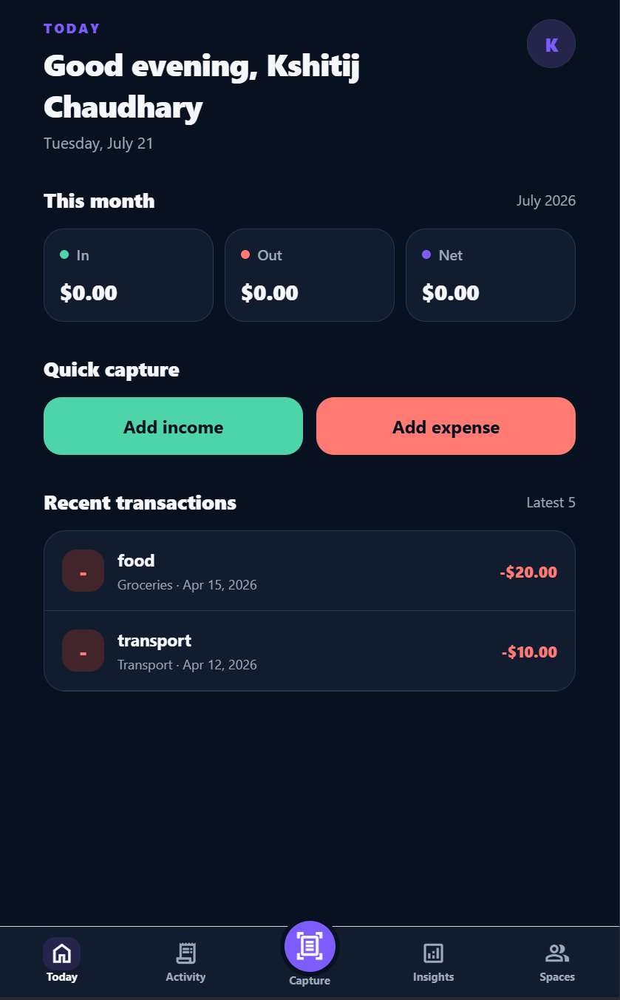
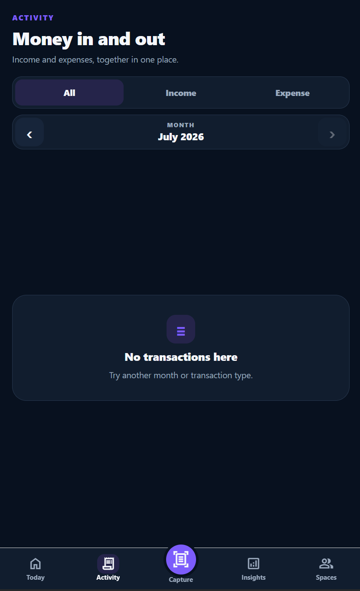
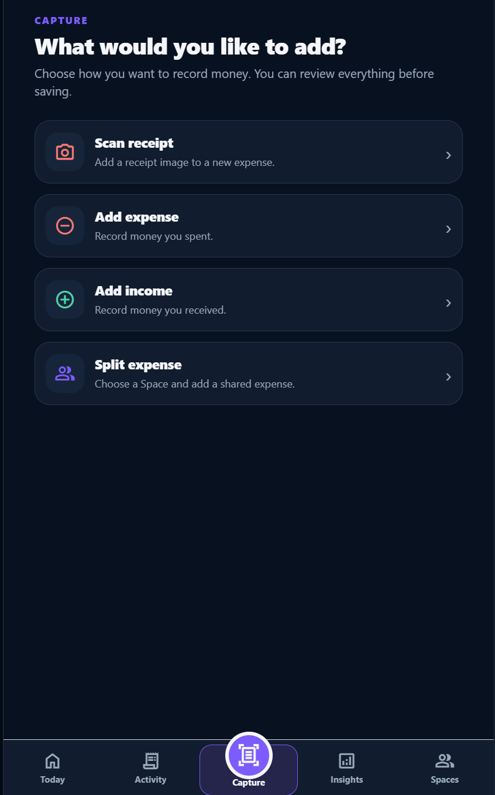
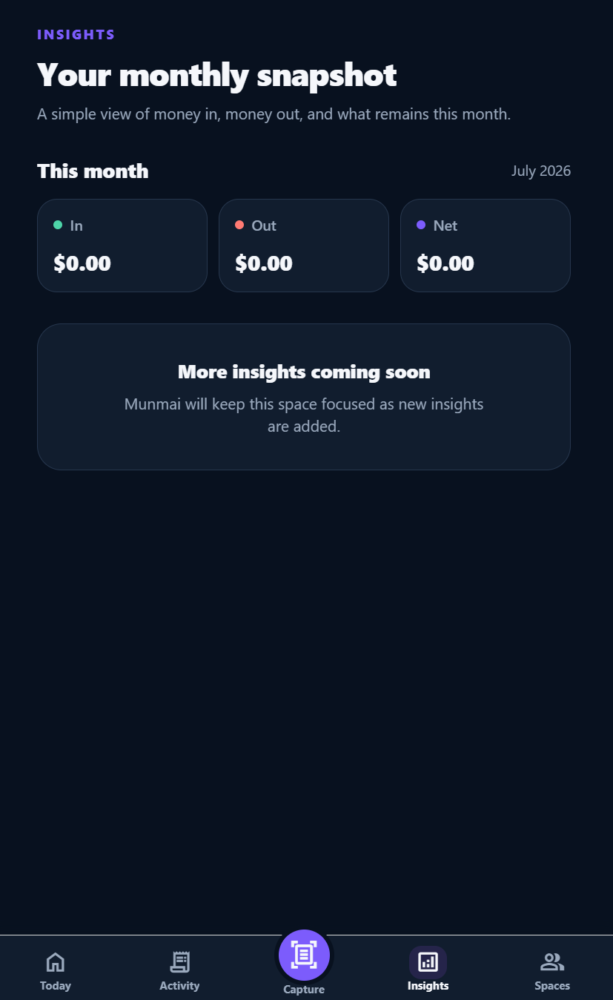
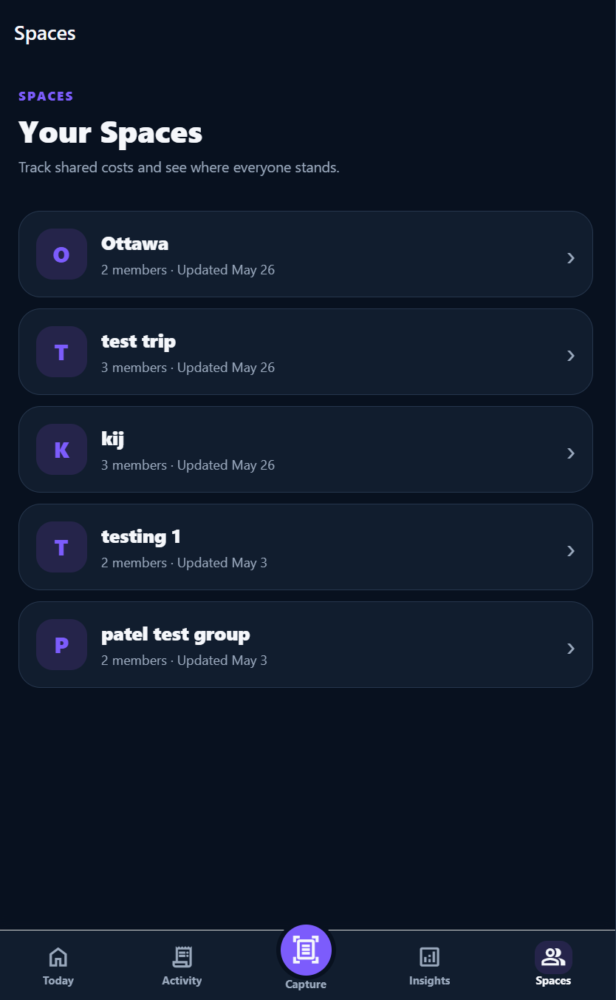

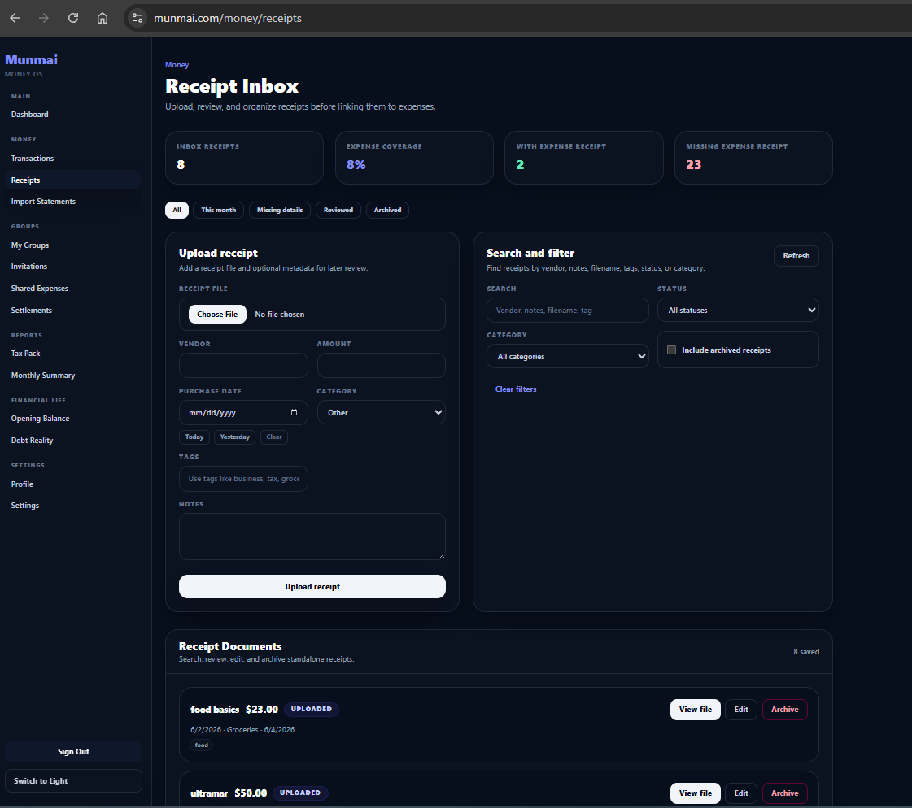

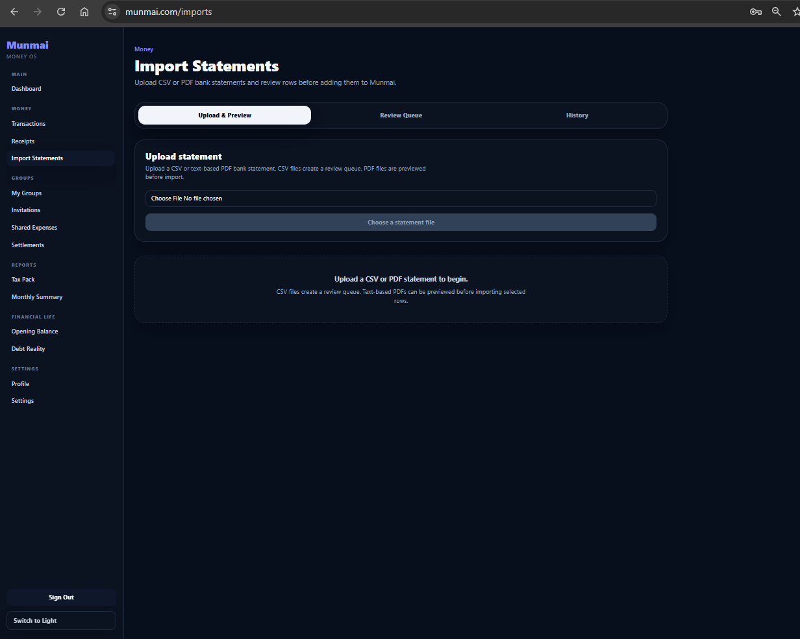

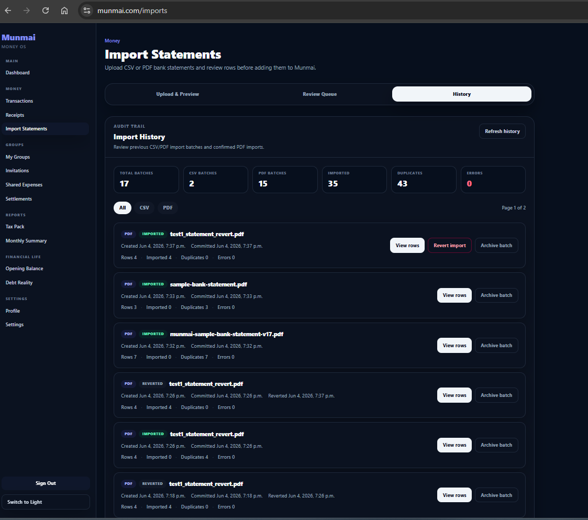

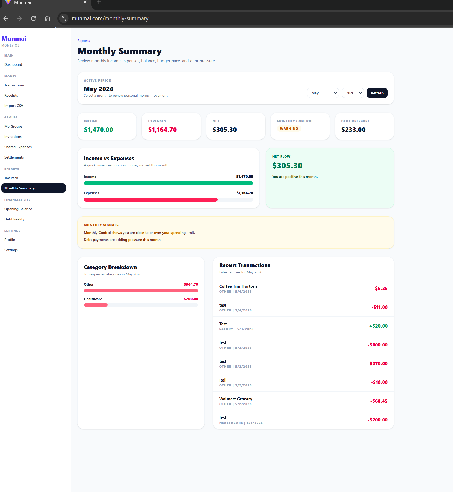

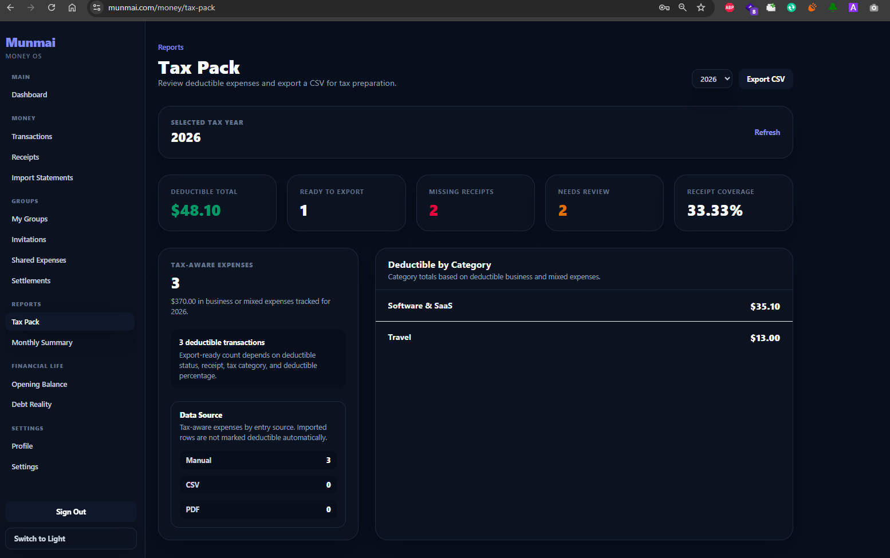

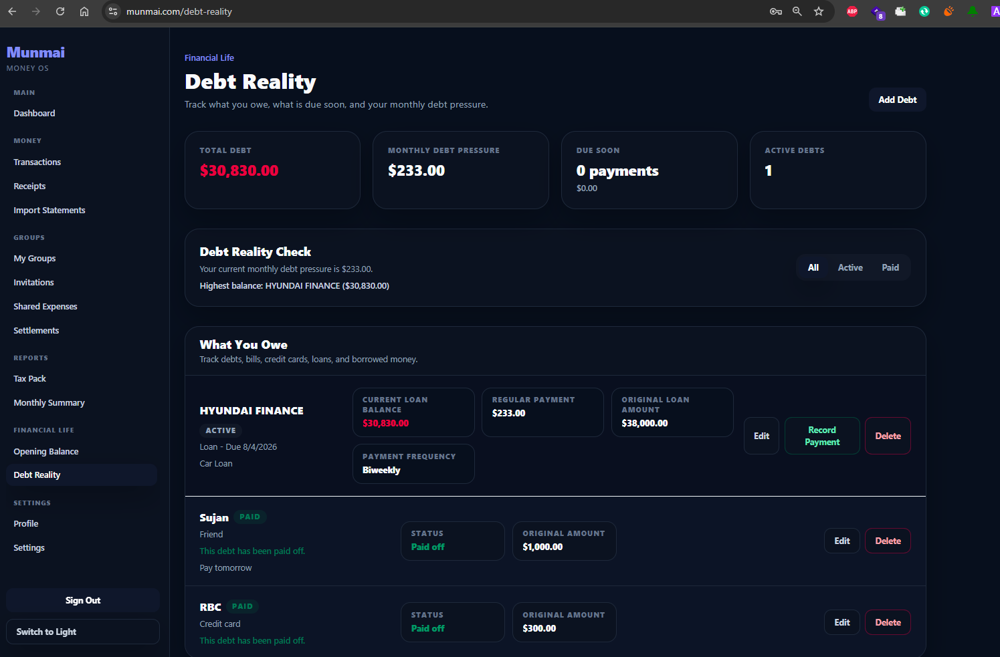

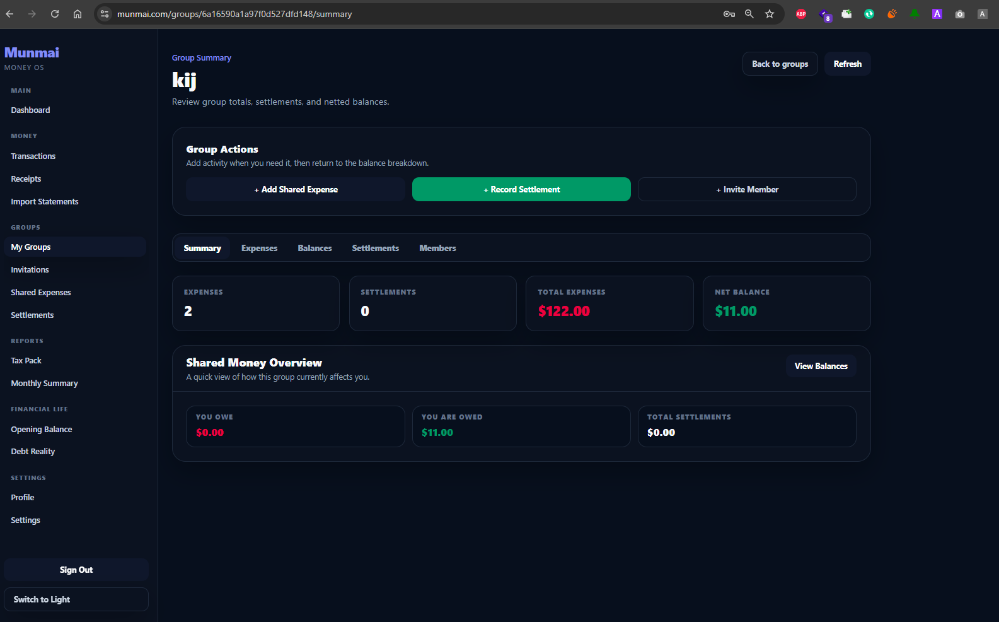

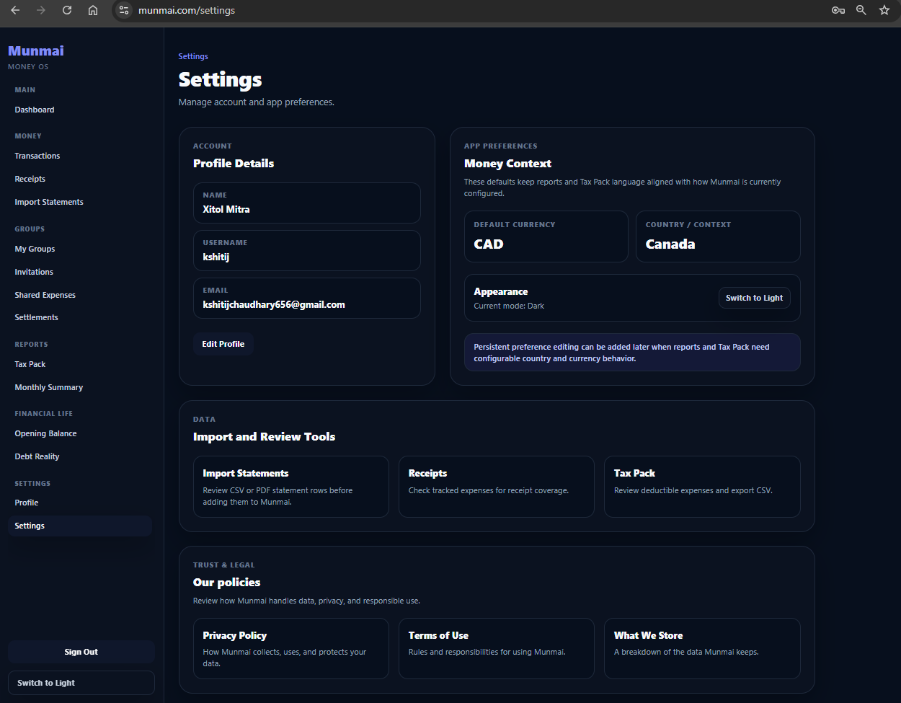

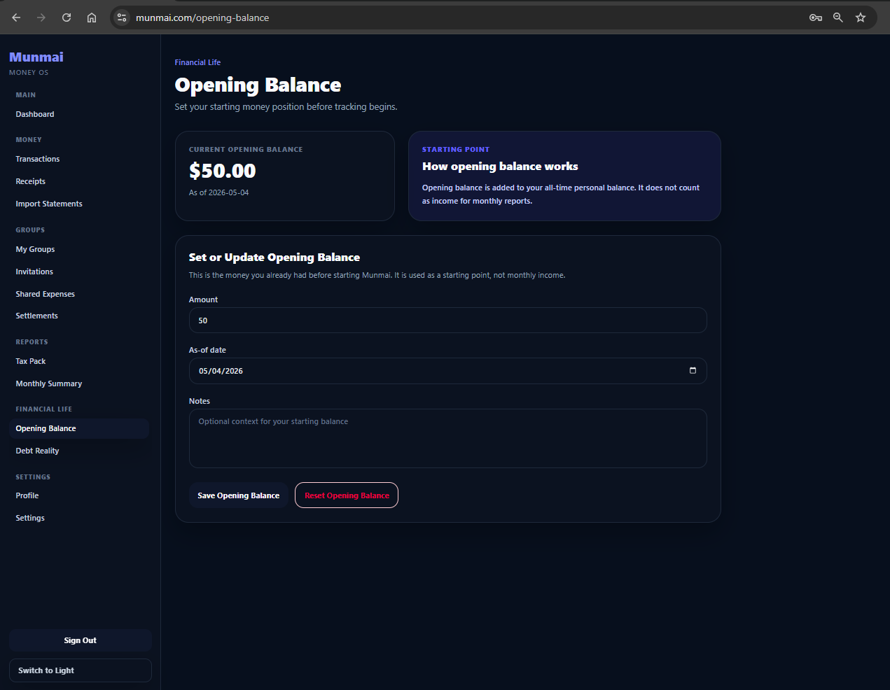
